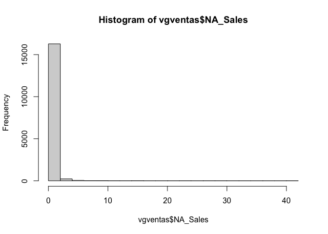
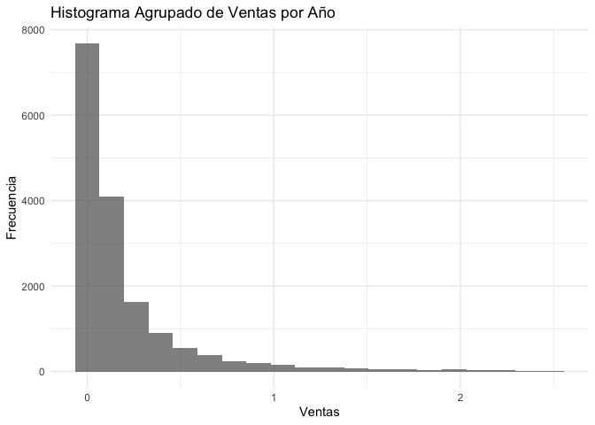

Games_Sales Data
================
Mia Wayar De La Vega
2025-10-02

## Librerias

``` r
library(dplyr)
```

    ## 
    ## Attaching package: 'dplyr'

    ## The following objects are masked from 'package:stats':
    ## 
    ##     filter, lag

    ## The following objects are masked from 'package:base':
    ## 
    ##     intersect, setdiff, setequal, union

``` r
library(ggplot2)
```

## Lectura de datos

``` r
#Archivo Kaggle - vgsales
vgventas <- read.csv("vgsales.csv",
                 stringsAsFactors = F,na.strings = ".",header = T,sep=",")
head(vgventas)
```

    ##   Rank                     Name Platform Year        Genre Publisher NA_Sales
    ## 1    1               Wii Sports      Wii 2006       Sports  Nintendo    41.49
    ## 2    2        Super Mario Bros.      NES 1985     Platform  Nintendo    29.08
    ## 3    3           Mario Kart Wii      Wii 2008       Racing  Nintendo    15.85
    ## 4    4        Wii Sports Resort      Wii 2009       Sports  Nintendo    15.75
    ## 5    5 Pokemon Red/Pokemon Blue       GB 1996 Role-Playing  Nintendo    11.27
    ## 6    6                   Tetris       GB 1989       Puzzle  Nintendo    23.20
    ##   EU_Sales JP_Sales Other_Sales Global_Sales
    ## 1    29.02     3.77        8.46        82.74
    ## 2     3.58     6.81        0.77        40.24
    ## 3    12.88     3.79        3.31        35.82
    ## 4    11.01     3.28        2.96        33.00
    ## 5     8.89    10.22        1.00        31.37
    ## 6     2.26     4.22        0.58        30.26

``` r
str(vgventas)
```

    ## 'data.frame':    16598 obs. of  11 variables:
    ##  $ Rank        : int  1 2 3 4 5 6 7 8 9 10 ...
    ##  $ Name        : chr  "Wii Sports" "Super Mario Bros." "Mario Kart Wii" "Wii Sports Resort" ...
    ##  $ Platform    : chr  "Wii" "NES" "Wii" "Wii" ...
    ##  $ Year        : chr  "2006" "1985" "2008" "2009" ...
    ##  $ Genre       : chr  "Sports" "Platform" "Racing" "Sports" ...
    ##  $ Publisher   : chr  "Nintendo" "Nintendo" "Nintendo" "Nintendo" ...
    ##  $ NA_Sales    : num  41.5 29.1 15.8 15.8 11.3 ...
    ##  $ EU_Sales    : num  29.02 3.58 12.88 11.01 8.89 ...
    ##  $ JP_Sales    : num  3.77 6.81 3.79 3.28 10.22 ...
    ##  $ Other_Sales : num  8.46 0.77 3.31 2.96 1 0.58 2.9 2.85 2.26 0.47 ...
    ##  $ Global_Sales: num  82.7 40.2 35.8 33 31.4 ...

## Transformacion de los datos

``` r
vgventas$Year <- as.integer(vgventas$Year)
```

    ## Warning: NAs introduced by coercion

``` r
vgventas$Genre <- as.factor(vgventas$Genre)
vgventas$Platform <- as.factor(vgventas$Platform)
vgventas$Publisher <- as.factor(vgventas$Publisher)
summary(vgventas)
```

    ##       Rank           Name              Platform         Year     
    ##  Min.   :    1   Length:16598       DS     :2163   Min.   :1980  
    ##  1st Qu.: 4151   Class :character   PS2    :2161   1st Qu.:2003  
    ##  Median : 8300   Mode  :character   PS3    :1329   Median :2007  
    ##  Mean   : 8301                      Wii    :1325   Mean   :2006  
    ##  3rd Qu.:12450                      X360   :1265   3rd Qu.:2010  
    ##  Max.   :16600                      PSP    :1213   Max.   :2020  
    ##                                     (Other):7142   NA's   :271   
    ##           Genre                             Publisher        NA_Sales      
    ##  Action      :3316   Electronic Arts             : 1351   Min.   : 0.0000  
    ##  Sports      :2346   Activision                  :  975   1st Qu.: 0.0000  
    ##  Misc        :1739   Namco Bandai Games          :  932   Median : 0.0800  
    ##  Role-Playing:1488   Ubisoft                     :  921   Mean   : 0.2647  
    ##  Shooter     :1310   Konami Digital Entertainment:  832   3rd Qu.: 0.2400  
    ##  Adventure   :1286   THQ                         :  715   Max.   :41.4900  
    ##  (Other)     :5113   (Other)                     :10872                    
    ##     EU_Sales          JP_Sales         Other_Sales        Global_Sales    
    ##  Min.   : 0.0000   Min.   : 0.00000   Min.   : 0.00000   Min.   : 0.0100  
    ##  1st Qu.: 0.0000   1st Qu.: 0.00000   1st Qu.: 0.00000   1st Qu.: 0.0600  
    ##  Median : 0.0200   Median : 0.00000   Median : 0.01000   Median : 0.1700  
    ##  Mean   : 0.1467   Mean   : 0.07778   Mean   : 0.04806   Mean   : 0.5374  
    ##  3rd Qu.: 0.1100   3rd Qu.: 0.04000   3rd Qu.: 0.04000   3rd Qu.: 0.4700  
    ##  Max.   :29.0200   Max.   :10.22000   Max.   :10.57000   Max.   :82.7400  
    ## 

``` r
str(vgventas)
```

    ## 'data.frame':    16598 obs. of  11 variables:
    ##  $ Rank        : int  1 2 3 4 5 6 7 8 9 10 ...
    ##  $ Name        : chr  "Wii Sports" "Super Mario Bros." "Mario Kart Wii" "Wii Sports Resort" ...
    ##  $ Platform    : Factor w/ 31 levels "2600","3DO","3DS",..: 26 12 26 26 6 6 5 26 26 12 ...
    ##  $ Year        : int  2006 1985 2008 2009 1996 1989 2006 2006 2009 1984 ...
    ##  $ Genre       : Factor w/ 12 levels "Action","Adventure",..: 11 5 7 11 8 6 5 4 5 9 ...
    ##  $ Publisher   : Factor w/ 579 levels "10TACLE Studios",..: 369 369 369 369 369 369 369 369 369 369 ...
    ##  $ NA_Sales    : num  41.5 29.1 15.8 15.8 11.3 ...
    ##  $ EU_Sales    : num  29.02 3.58 12.88 11.01 8.89 ...
    ##  $ JP_Sales    : num  3.77 6.81 3.79 3.28 10.22 ...
    ##  $ Other_Sales : num  8.46 0.77 3.31 2.96 1 0.58 2.9 2.85 2.26 0.47 ...
    ##  $ Global_Sales: num  82.7 40.2 35.8 33 31.4 ...

``` r
unique(vgventas$Year)
```

    ##  [1] 2006 1985 2008 2009 1996 1989 1984 2005 1999 2007 2010 2013 2004 1990 1988
    ## [16] 2002 2001 2011 1998 2015 2012 2014 1992 1997 1993 1994 1982 2003 1986 2000
    ## [31]   NA 1995 2016 1991 1981 1987 1980 1983 2020 2017

``` r
filter(vgventas, Year=="N/A")
```

    ##  [1] Rank         Name         Platform     Year         Genre       
    ##  [6] Publisher    NA_Sales     EU_Sales     JP_Sales     Other_Sales 
    ## [11] Global_Sales
    ## <0 rows> (or 0-length row.names)

``` r
unique(vgventas$Platform)
```

    ##  [1] Wii  NES  GB   DS   X360 PS3  PS2  SNES GBA  3DS  PS4  N64  PS   XB   PC  
    ## [16] 2600 PSP  XOne GC   WiiU GEN  DC   PSV  SAT  SCD  WS   NG   TG16 3DO  GG  
    ## [31] PCFX
    ## 31 Levels: 2600 3DO 3DS DC DS GB GBA GC GEN GG N64 NES NG PC PCFX PS ... XOne

``` r
filter(vgventas, Name=="FIFA 15")
```

    ##   Rank    Name Platform Year  Genre       Publisher NA_Sales EU_Sales JP_Sales
    ## 1  125 FIFA 15      PS4 2014 Sports Electronic Arts     0.79     4.29     0.05
    ## 2  220 FIFA 15      PS3 2014 Sports Electronic Arts     0.57     3.14     0.04
    ## 3  450 FIFA 15     X360 2014 Sports Electronic Arts     0.78     2.02     0.00
    ## 4  762 FIFA 15     XOne 2014 Sports Electronic Arts     0.60     1.41     0.00
    ## 5 2477 FIFA 15      PSV 2014 Sports Electronic Arts     0.13     0.48     0.04
    ## 6 2718 FIFA 15      Wii 2014 Sports Electronic Arts     0.24     0.46     0.00
    ## 7 4370 FIFA 15      3DS 2014 Sports Electronic Arts     0.09     0.33     0.00
    ## 8 5913 FIFA 15       PC 2014 Sports Electronic Arts     0.00     0.27     0.00
    ##   Other_Sales Global_Sales
    ## 1        1.47         6.59
    ## 2        1.07         4.82
    ## 3        0.30         3.11
    ## 4        0.14         2.15
    ## 5        0.19         0.84
    ## 6        0.06         0.76
    ## 7        0.03         0.45
    ## 8        0.03         0.30

``` r
hist(vgventas$NA_Sales )
```

<!-- -->

## Géneros más vendidos

``` r
vgventas %>%
  group_by(Genre) %>%
  summarise(Ventas_Totales = sum(Global_Sales)) %>%
  arrange(desc(Ventas_Totales)) %>%
  head(5)
```

    ## # A tibble: 5 × 2
    ##   Genre        Ventas_Totales
    ##   <fct>                 <dbl>
    ## 1 Action                1751.
    ## 2 Sports                1331.
    ## 3 Shooter               1037.
    ## 4 Role-Playing           927.
    ## 5 Platform               831.

Calculemos la proporcion de los datos missings Esto nos ayudará a
decidir la estrategia (borrar vs. llenar)

``` r
# Contar NA por columna
na_por_columna <- colSums(is.na(vgventas))
print("NA por columna:")
```

    ## [1] "NA por columna:"

``` r
print(na_por_columna)
```

    ##         Rank         Name     Platform         Year        Genre    Publisher 
    ##            0            0            0          271            0            0 
    ##     NA_Sales     EU_Sales     JP_Sales  Other_Sales Global_Sales 
    ##            0            0            0            0            0

``` r
# Porcentaje de NA por columna
porcentaje_na <- colMeans(is.na(vgventas)) * 100
print("Porcentaje de NA por columna:")
```

    ## [1] "Porcentaje de NA por columna:"

``` r
print(round(porcentaje_na, 2))
```

    ##         Rank         Name     Platform         Year        Genre    Publisher 
    ##         0.00         0.00         0.00         1.63         0.00         0.00 
    ##     NA_Sales     EU_Sales     JP_Sales  Other_Sales Global_Sales 
    ##         0.00         0.00         0.00         0.00         0.00

``` r
unique(vgventas$Publisher)
```

    ##   [1] Nintendo                              
    ##   [2] Microsoft Game Studios                
    ##   [3] Take-Two Interactive                  
    ##   [4] Sony Computer Entertainment           
    ##   [5] Activision                            
    ##   [6] Ubisoft                               
    ##   [7] Bethesda Softworks                    
    ##   [8] Electronic Arts                       
    ##   [9] Sega                                  
    ##  [10] SquareSoft                            
    ##  [11] Atari                                 
    ##  [12] 505 Games                             
    ##  [13] Capcom                                
    ##  [14] GT Interactive                        
    ##  [15] Konami Digital Entertainment          
    ##  [16] Sony Computer Entertainment Europe    
    ##  [17] Square Enix                           
    ##  [18] LucasArts                             
    ##  [19] Virgin Interactive                    
    ##  [20] Warner Bros. Interactive Entertainment
    ##  [21] Universal Interactive                 
    ##  [22] Eidos Interactive                     
    ##  [23] RedOctane                             
    ##  [24] Vivendi Games                         
    ##  [25] Enix Corporation                      
    ##  [26] Namco Bandai Games                    
    ##  [27] Palcom                                
    ##  [28] Hasbro Interactive                    
    ##  [29] THQ                                   
    ##  [30] Fox Interactive                       
    ##  [31] Acclaim Entertainment                 
    ##  [32] MTV Games                             
    ##  [33] Disney Interactive Studios            
    ##  [34] N/A                                   
    ##  [35] Majesco Entertainment                 
    ##  [36] Codemasters                           
    ##  [37] Red Orb                               
    ##  [38] Level 5                               
    ##  [39] Arena Entertainment                   
    ##  [40] Midway Games                          
    ##  [41] JVC                                   
    ##  [42] Deep Silver                           
    ##  [43] 989 Studios                           
    ##  [44] NCSoft                                
    ##  [45] UEP Systems                           
    ##  [46] Parker Bros.                          
    ##  [47] Maxis                                 
    ##  [48] Imagic                                
    ##  [49] Tecmo Koei                            
    ##  [50] Valve Software                        
    ##  [51] ASCII Entertainment                   
    ##  [52] Mindscape                             
    ##  [53] Infogrames                            
    ##  [54] Unknown                               
    ##  [55] Square                                
    ##  [56] Valve                                 
    ##  [57] Activision Value                      
    ##  [58] Banpresto                             
    ##  [59] D3Publisher                           
    ##  [60] Oxygen Interactive                    
    ##  [61] Red Storm Entertainment               
    ##  [62] Video System                          
    ##  [63] Hello Games                           
    ##  [64] Global Star                           
    ##  [65] Gotham Games                          
    ##  [66] Westwood Studios                      
    ##  [67] GungHo                                
    ##  [68] Crave Entertainment                   
    ##  [69] Hudson Soft                           
    ##  [70] Coleco                                
    ##  [71] Rising Star Games                     
    ##  [72] Atlus                                 
    ##  [73] TDK Mediactive                        
    ##  [74] ASC Games                             
    ##  [75] Zoo Games                             
    ##  [76] Accolade                              
    ##  [77] Sony Online Entertainment             
    ##  [78] 3DO                                   
    ##  [79] RTL                                   
    ##  [80] Natsume                               
    ##  [81] Focus Home Interactive                
    ##  [82] Alchemist                             
    ##  [83] Black Label Games                     
    ##  [84] SouthPeak Games                       
    ##  [85] Mastertronic                          
    ##  [86] Ocean                                 
    ##  [87] Zoo Digital Publishing                
    ##  [88] Psygnosis                             
    ##  [89] City Interactive                      
    ##  [90] Empire Interactive                    
    ##  [91] Success                               
    ##  [92] Compile                               
    ##  [93] Russel                                
    ##  [94] Taito                                 
    ##  [95] Agetec                                
    ##  [96] GSP                                   
    ##  [97] Microprose                            
    ##  [98] Play It                               
    ##  [99] Slightly Mad Studios                  
    ## [100] Tomy Corporation                      
    ## [101] Sammy Corporation                     
    ## [102] Koch Media                            
    ## [103] Game Factory                          
    ## [104] Titus                                 
    ## [105] Marvelous Entertainment               
    ## [106] Genki                                 
    ## [107] Mojang                                
    ## [108] Pinnacle                              
    ## [109] CTO SpA                               
    ## [110] TalonSoft                             
    ## [111] Crystal Dynamics                      
    ## [112] SCi                                   
    ## [113] Quelle                                
    ## [114] mixi, Inc                             
    ## [115] Rage Software                         
    ## [116] Ubisoft Annecy                        
    ## [117] Scholastic Inc.                       
    ## [118] Interplay                             
    ## [119] Mystique                              
    ## [120] ChunSoft                              
    ## [121] Square EA                             
    ## [122] 20th Century Fox Video Games          
    ## [123] Avanquest Software                    
    ## [124] Hudson Entertainment                  
    ## [125] Nordic Games                          
    ## [126] Men-A-Vision                          
    ## [127] Nobilis                               
    ## [128] Big Ben Interactive                   
    ## [129] Touchstone                            
    ## [130] Spike                                 
    ## [131] Jester Interactive                    
    ## [132] Nippon Ichi Software                  
    ## [133] LEGO Media                            
    ## [134] Quest                                 
    ## [135] Illusion Softworks                    
    ## [136] Tigervision                           
    ## [137] Funbox Media                          
    ## [138] Rocket Company                        
    ## [139] Metro 3D                              
    ## [140] Mattel Interactive                    
    ## [141] IE Institute                          
    ## [142] Rondomedia                            
    ## [143] Sony Computer Entertainment America   
    ## [144] Universal Gamex                       
    ## [145] Ghostlight                            
    ## [146] Wizard Video Games                    
    ## [147] BMG Interactive Entertainment         
    ## [148] PQube                                 
    ## [149] Trion Worlds                          
    ## [150] Laguna                                
    ## [151] Ignition Entertainment                
    ## [152] Takara                                
    ## [153] Kadokawa Shoten                       
    ## [154] Destineer                             
    ## [155] Enterbrain                            
    ## [156] Xseed Games                           
    ## [157] Imagineer                             
    ## [158] System 3 Arcade Software              
    ## [159] CPG Products                          
    ## [160] Aruze Corp                            
    ## [161] Gamebridge                            
    ## [162] Midas Interactive Entertainment       
    ## [163] Jaleco                                
    ## [164] Answer Software                       
    ## [165] XS Games                              
    ## [166] Activision Blizzard                   
    ## [167] Pack In Soft                          
    ## [168] Rebellion                             
    ## [169] Xplosiv                               
    ## [170] Ultravision                           
    ## [171] GameMill Entertainment                
    ## [172] Wanadoo                               
    ## [173] NovaLogic                             
    ## [174] Telltale Games                        
    ## [175] Epoch                                 
    ## [176] BAM! Entertainment                    
    ## [177] Knowledge Adventure                   
    ## [178] Mastiff                               
    ## [179] Tetris Online                         
    ## [180] Harmonix Music Systems                
    ## [181] ESP                                   
    ## [182] TYO                                   
    ## [183] Telegames                             
    ## [184] Mud Duck Productions                  
    ## [185] Screenlife                            
    ## [186] Pioneer LDC                           
    ## [187] Magical Company                       
    ## [188] Mentor Interactive                    
    ## [189] Kemco                                 
    ## [190] Human Entertainment                   
    ## [191] Avanquest                             
    ## [192] Data Age                              
    ## [193] Electronic Arts Victor                
    ## [194] Black Bean Games                      
    ## [195] Jack of All Games                     
    ## [196] 989 Sports                            
    ## [197] Takara Tomy                           
    ## [198] Media Rings                           
    ## [199] Elf                                   
    ## [200] Kalypso Media                         
    ## [201] Starfish                              
    ## [202] Zushi Games                           
    ## [203] Jorudan                               
    ## [204] Destination Software, Inc             
    ## [205] New                                   
    ## [206] Brash Entertainment                   
    ## [207] ITT Family Games                      
    ## [208] PopCap Games                          
    ## [209] Home Entertainment Suppliers          
    ## [210] Ackkstudios                           
    ## [211] Starpath Corp.                        
    ## [212] P2 Games                              
    ## [213] BPS                                   
    ## [214] Gathering of Developers               
    ## [215] NewKidCo                              
    ## [216] Storm City Games                      
    ## [217] CokeM Interactive                     
    ## [218] CBS Electronics                       
    ## [219] Magix                                 
    ## [220] Marvelous Interactive                 
    ## [221] Nihon Falcom Corporation              
    ## [222] Wargaming.net                         
    ## [223] Angel Studios                         
    ## [224] Arc System Works                      
    ## [225] Playmates                             
    ## [226] SNK Playmore                          
    ## [227] Hamster Corporation                   
    ## [228] From Software                         
    ## [229] Nippon Columbia                       
    ## [230] Nichibutsu                            
    ## [231] Little Orbit                          
    ## [232] Conspiracy Entertainment              
    ## [233] DTP Entertainment                     
    ## [234] Hect                                  
    ## [235] Mumbo Jumbo                           
    ## [236] Pacific Century Cyber Works           
    ## [237] Indie Games                           
    ## [238] Liquid Games                          
    ## [239] NEC                                   
    ## [240] Axela                                 
    ## [241] ArtDink                               
    ## [242] Sunsoft                               
    ## [243] Gust                                  
    ## [244] SNK                                   
    ## [245] NEC Interchannel                      
    ## [246] FuRyu                                 
    ## [247] Xing Entertainment                    
    ## [248] ValuSoft                              
    ## [249] Victor Interactive                    
    ## [250] Detn8 Games                           
    ## [251] American Softworks                    
    ## [252] Nordcurrent                           
    ## [253] Bomb                                  
    ## [254] Falcom Corporation                    
    ## [255] AQ Interactive                        
    ## [256] CCP                                   
    ## [257] Milestone S.r.l.                      
    ## [258] Sears                                 
    ## [259] JoWood Productions                    
    ## [260] Seta Corporation                      
    ## [261] On Demand                             
    ## [262] NCS                                   
    ## [263] Aspyr                                 
    ## [264] Gremlin Interactive Ltd               
    ## [265] Agatsuma Entertainment                
    ## [266] Compile Heart                         
    ## [267] Culture Brain                         
    ## [268] Mad Catz                              
    ## [269] Shogakukan                            
    ## [270] Merscom LLC                           
    ## [271] Rebellion Developments                
    ## [272] Nippon Telenet                        
    ## [273] TDK Core                              
    ## [274] bitComposer Games                     
    ## [275] Foreign Media Games                   
    ## [276] Astragon                              
    ## [277] SSI                                   
    ## [278] Kadokawa Games                        
    ## [279] Idea Factory                          
    ## [280] Performance Designed Products         
    ## [281] Asylum Entertainment                  
    ## [282] Core Design Ltd.                      
    ## [283] PlayV                                 
    ## [284] UFO Interactive                       
    ## [285] Idea Factory International            
    ## [286] Playlogic Game Factory                
    ## [287] Essential Games                       
    ## [288] Adeline Software                      
    ## [289] Funcom                                
    ## [290] Panther Software                      
    ## [291] Blast! Entertainment Ltd              
    ## [292] Game Life                             
    ## [293] DSI Games                             
    ## [294] Avalon Interactive                    
    ## [295] Popcorn Arcade                        
    ## [296] Neko Entertainment                    
    ## [297] Vir2L Studios                         
    ## [298] Aques                                 
    ## [299] Syscom                                
    ## [300] White Park Bay Software               
    ## [301] System 3                              
    ## [302] Vatical Entertainment                 
    ## [303] Daedalic                              
    ## [304] EA Games                              
    ## [305] Media Factory                         
    ## [306] Vic Tokai                             
    ## [307] The Adventure Company                 
    ## [308] Game Arts                             
    ## [309] Broccoli                              
    ## [310] Acquire                               
    ## [311] General Entertainment                 
    ## [312] Excalibur Publishing                  
    ## [313] Imadio                                
    ## [314] Swing! Entertainment                  
    ## [315] Sony Music Entertainment              
    ## [316] Aqua Plus                             
    ## [317] Paradox Interactive                   
    ## [318] Hip Interactive                       
    ## [319] DreamCatcher Interactive              
    ## [320] Tripwire Interactive                  
    ## [321] Sting                                 
    ## [322] Yacht Club Games                      
    ## [323] SCS Software                          
    ## [324] Bigben Interactive                    
    ## [325] Havas Interactive                     
    ## [326] Slitherine Software                   
    ## [327] Graffiti                              
    ## [328] Funsta                                
    ## [329] Telstar                               
    ## [330] U.S. Gold                             
    ## [331] DreamWorks Interactive                
    ## [332] Data Design Interactive               
    ## [333] MTO                                   
    ## [334] DHM Interactive                       
    ## [335] FunSoft                               
    ## [336] SPS                                   
    ## [337] Bohemia Interactive                   
    ## [338] Reef Entertainment                    
    ## [339] Tru Blu Entertainment                 
    ## [340] Moss                                  
    ## [341] T&E Soft                              
    ## [342] O-Games                               
    ## [343] Aksys Games                           
    ## [344] NDA Productions                       
    ## [345] Data East                             
    ## [346] Time Warner Interactive               
    ## [347] Gainax Network Systems                
    ## [348] Daito                                 
    ## [349] O3 Entertainment                      
    ## [350] Gameloft                              
    ## [351] Xicat Interactive                     
    ## [352] Simon & Schuster Interactive          
    ## [353] Valcon Games                          
    ## [354] PopTop Software                       
    ## [355] TOHO                                  
    ## [356] HMH Interactive                       
    ## [357] 5pb                                   
    ## [358] Cave                                  
    ## [359] CDV Software Entertainment            
    ## [360] Microids                              
    ## [361] PM Studios                            
    ## [362] Paon                                  
    ## [363] Micro Cabin                           
    ## [364] GameTek                               
    ## [365] Benesse                               
    ## [366] Type-Moon                             
    ## [367] Enjoy Gaming ltd.                     
    ## [368] Asmik Corp                            
    ## [369] Interplay Productions                 
    ## [370] Asmik Ace Entertainment               
    ## [371] inXile Entertainment                  
    ## [372] Image Epoch                           
    ## [373] Phantom EFX                           
    ## [374] Evolved Games                         
    ## [375] responDESIGN                          
    ## [376] Culture Publishers                    
    ## [377] Griffin International                 
    ## [378] Hackberry                             
    ## [379] Hearty Robin                          
    ## [380] Nippon Amuse                          
    ## [381] Origin Systems                        
    ## [382] Seventh Chord                         
    ## [383] Mitsui                                
    ## [384] Milestone                             
    ## [385] Abylight                              
    ## [386] Flight-Plan                           
    ## [387] Glams                                 
    ## [388] Locus                                 
    ## [389] Warp                                  
    ## [390] Daedalic Entertainment                
    ## [391] Alternative Software                  
    ## [392] Myelin Media                          
    ## [393] Mercury Games                         
    ## [394] Irem Software Engineering             
    ## [395] Sunrise Interactive                   
    ## [396] Elite                                 
    ## [397] Evolution Games                       
    ## [398] Tivola                                
    ## [399] Global A Entertainment                
    ## [400] Edia                                  
    ## [401] Athena                                
    ## [402] Aria                                  
    ## [403] Gamecock                              
    ## [404] Tommo                                 
    ## [405] Altron                                
    ## [406] Happinet                              
    ## [407] iWin                                  
    ## [408] Media Works                           
    ## [409] Fortyfive                             
    ## [410] Revolution Software                   
    ## [411] Imax                                  
    ## [412] Crimson Cow                           
    ## [413] 10TACLE Studios                       
    ## [414] Groove Games                          
    ## [415] Pack-In-Video                         
    ## [416] Insomniac Games                       
    ## [417] Ascaron Entertainment GmbH            
    ## [418] Asgard                                
    ## [419] Ecole                                 
    ## [420] Yumedia                               
    ## [421] Phenomedia                            
    ## [422] HAL Laboratory                        
    ## [423] Grand Prix Games                      
    ## [424] DigiCube                              
    ## [425] Creative Core                         
    ## [426] Kaga Create                           
    ## [427] WayForward Technologies               
    ## [428] LSP Games                             
    ## [429] ASCII Media Works                     
    ## [430] Coconuts Japan                        
    ## [431] Arika                                 
    ## [432] Ertain                                
    ## [433] Marvel Entertainment                  
    ## [434] Prototype                             
    ## [435] TopWare Interactive                   
    ## [436] Phantagram                            
    ## [437] 1C Company                            
    ## [438] The Learning Company                  
    ## [439] TechnoSoft                            
    ## [440] Vap                                   
    ## [441] Misawa                                
    ## [442] Tradewest                             
    ## [443] Team17 Software                       
    ## [444] Yeti                                  
    ## [445] Pow                                   
    ## [446] Navarre Corp                          
    ## [447] MediaQuest                            
    ## [448] Max Five                              
    ## [449] Comfort                               
    ## [450] Monte Christo Multimedia              
    ## [451] Pony Canyon                           
    ## [452] Riverhillsoft                         
    ## [453] Summitsoft                            
    ## [454] Milestone S.r.l                       
    ## [455] Playmore                              
    ## [456] MLB.com                               
    ## [457] Kool Kizz                             
    ## [458] Flashpoint Games                      
    ## [459] 49Games                               
    ## [460] Legacy Interactive                    
    ## [461] Alawar Entertainment                  
    ## [462] CyberFront                            
    ## [463] Cloud Imperium Games Corporation      
    ## [464] Societa                               
    ## [465] Virtual Play Games                    
    ## [466] Interchannel                          
    ## [467] Sonnet                                
    ## [468] Experience Inc.                       
    ## [469] Zenrin                                
    ## [470] Iceberg Interactive                   
    ## [471] Ivolgamus                             
    ## [472] 2D Boy                                
    ## [473] MC2 Entertainment                     
    ## [474] Kando Games                           
    ## [475] Just Flight                           
    ## [476] Office Create                         
    ## [477] Mamba Games                           
    ## [478] Fields                                
    ## [479] Princess Soft                         
    ## [480] Maximum Family Games                  
    ## [481] Berkeley                              
    ## [482] Fuji                                  
    ## [483] Dusenberry Martin Racing              
    ## [484] imageepoch Inc.                       
    ## [485] Big Fish Games                        
    ## [486] Her Interactive                       
    ## [487] Kamui                                 
    ## [488] ASK                                   
    ## [489] Headup Games                          
    ## [490] KSS                                   
    ## [491] Cygames                               
    ## [492] KID                                   
    ## [493] Quinrose                              
    ## [494] Sunflowers                            
    ## [495] dramatic create                       
    ## [496] TGL                                   
    ## [497] Encore                                
    ## [498] Extreme Entertainment Group           
    ## [499] Intergrow                             
    ## [500] G.Rev                                 
    ## [501] Sweets                                
    ## [502] Kokopeli Digital Studios              
    ## [503] Number None                           
    ## [504] Nexon                                 
    ## [505] id Software                           
    ## [506] BushiRoad                             
    ## [507] Tryfirst                              
    ## [508] Strategy First                        
    ## [509] 7G//AMES                              
    ## [510] GN Software                           
    ## [511] Yuke's                                
    ## [512] Easy Interactive                      
    ## [513] Licensed 4U                           
    ## [514] FuRyu Corporation                     
    ## [515] Lexicon Entertainment                 
    ## [516] Paon Corporation                      
    ## [517] Kids Station                          
    ## [518] GOA                                   
    ## [519] Graphsim Entertainment                
    ## [520] King Records                          
    ## [521] Introversion Software                 
    ## [522] Minato Station                        
    ## [523] Devolver Digital                      
    ## [524] Blue Byte                             
    ## [525] Gaga                                  
    ## [526] Yamasa Entertainment                  
    ## [527] Plenty                                
    ## [528] Views                                 
    ## [529] fonfun                                
    ## [530] NetRevo                               
    ## [531] Codemasters Online                    
    ## [532] Quintet                               
    ## [533] Phoenix Games                         
    ## [534] Dorart                                
    ## [535] Marvelous Games                       
    ## [536] Focus Multimedia                      
    ## [537] Imageworks                            
    ## [538] Karin Entertainment                   
    ## [539] Aerosoft                              
    ## [540] Technos Japan Corporation             
    ## [541] Gakken                                
    ## [542] Mirai Shounen                         
    ## [543] Datam Polystar                        
    ## [544] Saurus                                
    ## [545] HuneX                                 
    ## [546] Revolution (Japan)                    
    ## [547] Giza10                                
    ## [548] Visco                                 
    ## [549] Alvion                                
    ## [550] Mycom                                 
    ## [551] Giga                                  
    ## [552] Warashi                               
    ## [553] System Soft                           
    ## [554] Sold Out                              
    ## [555] Lighthouse Interactive                
    ## [556] Masque Publishing                     
    ## [557] RED Entertainment                     
    ## [558] Michaelsoft                           
    ## [559] Media Entertainment                   
    ## [560] New World Computing                   
    ## [561] Genterprise                           
    ## [562] Interworks Unlimited, Inc.            
    ## [563] Boost On                              
    ## [564] Stainless Games                       
    ## [565] EON Digital Entertainment             
    ## [566] Epic Games                            
    ## [567] Naxat Soft                            
    ## [568] Ascaron Entertainment                 
    ## [569] Piacci                                
    ## [570] Nitroplus                             
    ## [571] Paradox Development                   
    ## [572] Otomate                               
    ## [573] Ongakukan                             
    ## [574] Commseed                              
    ## [575] Inti Creates                          
    ## [576] Takuyo                                
    ## [577] Interchannel-Holon                    
    ## [578] Rain Games                            
    ## [579] UIG Entertainment                     
    ## 579 Levels: 10TACLE Studios 1C Company 20th Century Fox Video Games ... Zushi Games

``` r
filter(vgventas, Publisher==" ")
```

    ##  [1] Rank         Name         Platform     Year         Genre       
    ##  [6] Publisher    NA_Sales     EU_Sales     JP_Sales     Other_Sales 
    ## [11] Global_Sales
    ## <0 rows> (or 0-length row.names)

A año le faltan 271 valores (aprox 1,63%). Dado que este porcentaje es
muy pequeño, la estrategia más segura y sencilla es eliminar estas
filas. Intentar ‘adivinar’ (imputar) el año o la editorial podría
generar interferencias y llevar a conclusiones incorrectas. Queremos que
nuestro análisis se base en datos completos y precisos. Usaremos
.dropna() para eliminar las filas que contienen valores NaN en las
columnas especificadas.

``` r
# DataFrame de ejemplo con missing values

print("DataFrame original:")
```

    ## [1] "DataFrame original:"

``` r
head(vgventas)
```

    ##   Rank                     Name Platform Year        Genre Publisher NA_Sales
    ## 1    1               Wii Sports      Wii 2006       Sports  Nintendo    41.49
    ## 2    2        Super Mario Bros.      NES 1985     Platform  Nintendo    29.08
    ## 3    3           Mario Kart Wii      Wii 2008       Racing  Nintendo    15.85
    ## 4    4        Wii Sports Resort      Wii 2009       Sports  Nintendo    15.75
    ## 5    5 Pokemon Red/Pokemon Blue       GB 1996 Role-Playing  Nintendo    11.27
    ## 6    6                   Tetris       GB 1989       Puzzle  Nintendo    23.20
    ##   EU_Sales JP_Sales Other_Sales Global_Sales
    ## 1    29.02     3.77        8.46        82.74
    ## 2     3.58     6.81        0.77        40.24
    ## 3    12.88     3.79        3.31        35.82
    ## 4    11.01     3.28        2.96        33.00
    ## 5     8.89    10.22        1.00        31.37
    ## 6     2.26     4.22        0.58        30.26

``` r
cat("Filas originales:", nrow(vgventas), "\n\n")
```

    ## Filas originales: 16598

``` r
# Método 1: na.omit() - Elimina filas con cualquier NA
df_sin_na <- na.omit(vgventas)
print("Con na.omit():")
```

    ## [1] "Con na.omit():"

``` r
head(df_sin_na)
```

    ##   Rank                     Name Platform Year        Genre Publisher NA_Sales
    ## 1    1               Wii Sports      Wii 2006       Sports  Nintendo    41.49
    ## 2    2        Super Mario Bros.      NES 1985     Platform  Nintendo    29.08
    ## 3    3           Mario Kart Wii      Wii 2008       Racing  Nintendo    15.85
    ## 4    4        Wii Sports Resort      Wii 2009       Sports  Nintendo    15.75
    ## 5    5 Pokemon Red/Pokemon Blue       GB 1996 Role-Playing  Nintendo    11.27
    ## 6    6                   Tetris       GB 1989       Puzzle  Nintendo    23.20
    ##   EU_Sales JP_Sales Other_Sales Global_Sales
    ## 1    29.02     3.77        8.46        82.74
    ## 2     3.58     6.81        0.77        40.24
    ## 3    12.88     3.79        3.31        35.82
    ## 4    11.01     3.28        2.96        33.00
    ## 5     8.89    10.22        1.00        31.37
    ## 6     2.26     4.22        0.58        30.26

``` r
cat("Filas después de na.omit():", nrow(df_sin_na), "\n\n")
```

    ## Filas después de na.omit(): 16327

``` r
# Método 2: complete.cases() - Más control
df_completo <- vgventas[complete.cases(vgventas), ]
print("Con complete.cases():")
```

    ## [1] "Con complete.cases():"

``` r
head(df_completo)
```

    ##   Rank                     Name Platform Year        Genre Publisher NA_Sales
    ## 1    1               Wii Sports      Wii 2006       Sports  Nintendo    41.49
    ## 2    2        Super Mario Bros.      NES 1985     Platform  Nintendo    29.08
    ## 3    3           Mario Kart Wii      Wii 2008       Racing  Nintendo    15.85
    ## 4    4        Wii Sports Resort      Wii 2009       Sports  Nintendo    15.75
    ## 5    5 Pokemon Red/Pokemon Blue       GB 1996 Role-Playing  Nintendo    11.27
    ## 6    6                   Tetris       GB 1989       Puzzle  Nintendo    23.20
    ##   EU_Sales JP_Sales Other_Sales Global_Sales
    ## 1    29.02     3.77        8.46        82.74
    ## 2     3.58     6.81        0.77        40.24
    ## 3    12.88     3.79        3.31        35.82
    ## 4    11.01     3.28        2.96        33.00
    ## 5     8.89    10.22        1.00        31.37
    ## 6     2.26     4.22        0.58        30.26

``` r
cat("Filas después de complete.cases():", nrow(df_completo), "\n")
```

    ## Filas después de complete.cases(): 16327

# Tendencia Central

``` r
unique(vgventas$Platform)
```

    ##  [1] Wii  NES  GB   DS   X360 PS3  PS2  SNES GBA  3DS  PS4  N64  PS   XB   PC  
    ## [16] 2600 PSP  XOne GC   WiiU GEN  DC   PSV  SAT  SCD  WS   NG   TG16 3DO  GG  
    ## [31] PCFX
    ## 31 Levels: 2600 3DO 3DS DC DS GB GBA GC GEN GG N64 NES NG PC PCFX PS ... XOne

Graficos

``` r
df <- filter(vgventas,NA_Sales<2.5)
# Histograma agrupado por categoría
ggplot( df , aes(x = NA_Sales)) +
  geom_histogram(position = "dodge", alpha = 0.7, bins = 20) +
  labs(title = "Histograma Agrupado de Ventas por Año",
       x = "Ventas",
       y = "Frecuencia") +
  theme_minimal()
```

<!-- -->

``` r
# Extraer una muestra aleatoria de 300 datos
set.seed(123)  
muestra <- vgventas %>% sample_n(300)

# Calcular la media y desviación estándar de las variables numéricas (población)
estadisticas_poblacion <- vgventas %>%
  summarise_if(is.numeric, list(
    media = mean,
    desviacion = sd
  ), na.rm = TRUE)

# Calcular la media y desviación estándar de las variables numéricas (muestra)
estadisticas_muestra <- muestra %>%
  summarise_if(is.numeric, list(
    media = mean,
    desviacion = sd
  ), na.rm = TRUE)

# Comparar ambas
comparacion <- bind_rows(
  Poblacion = estadisticas_poblacion,
  Muestra = estadisticas_muestra,
  .id = "Origen"
)

# Mostrar la comparación
print(comparacion)
```

    ##      Origen Rank_media Year_media NA_Sales_media EU_Sales_media JP_Sales_media
    ## 1 Poblacion   8300.605   2006.406      0.2646674      0.1466520     0.07778166
    ## 2   Muestra   8725.370   2006.000      0.2489000      0.1194667     0.08113333
    ##   Other_Sales_media Global_Sales_media Rank_desviacion Year_desviacion
    ## 1        0.04806302          0.5374407        4791.854        5.828981
    ## 2        0.03790000          0.4876333        4723.723        6.360653
    ##   NA_Sales_desviacion EU_Sales_desviacion JP_Sales_desviacion
    ## 1           0.8166830           0.5053512           0.3092906
    ## 2           0.6525057           0.4331549           0.2803284
    ##   Other_Sales_desviacion Global_Sales_desviacion
    ## 1              0.1885884                1.555028
    ## 2              0.1289860                1.318012
